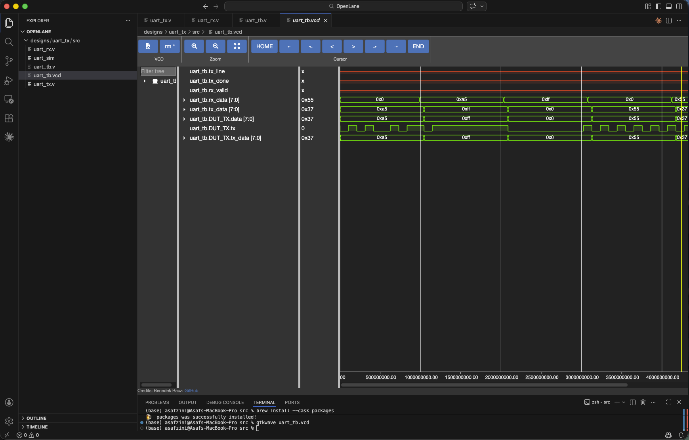
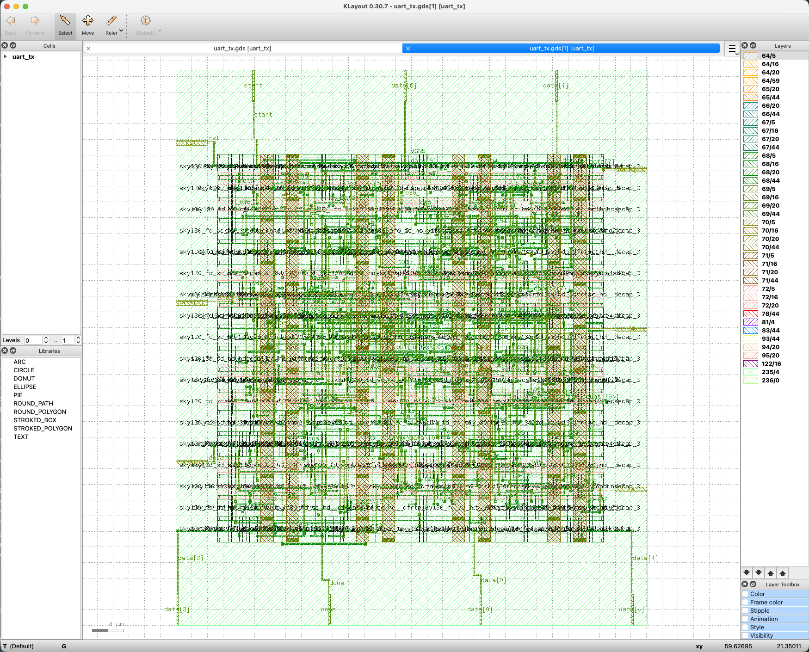

# UART Controller — Full RTL-to-GDS ASIC Implementation

A synthesizable UART (Universal Asynchronous Receiver-Transmitter) controller
implemented in Verilog and taken through a full ASIC flow using OpenLane on
the SkyWater sky130 130nm PDK.

## Results

| Metric | Value |
|--------|-------|
| Clock Frequency | 100 MHz |
| Process Node | sky130 (130nm) |
| Standard Cell Library | sky130_fd_sc_hd |
| Core Area | ~59 x 21 µm |
| Flow | RTL → Synthesis → Floorplan → Placement → CTS → Routing → GDS |

## Simulation

All 5 test vectors passed:
```
PASS: sent 0xA5  received 0xA5
PASS: sent 0xFF  received 0xFF
PASS: sent 0x00  received 0x00
PASS: sent 0x55  received 0x55
PASS: sent 0x37  received 0x37
ALL TESTS PASSED
```

## Waveform



## GDS Layout



## Project Structure
```
├── src/
│   ├── uart_tx.v       # Transmitter RTL
│   ├── uart_rx.v       # Receiver RTL
│   └── uart_tb.v       # Testbench
├── results/
│   ├── waveform.png        # GTKWave simulation output
│   ├── layout.png          # KLayout GDS view
│   ├── timing_report.txt   # OpenROAD STA report
│   └── simulation_results.txt
```

## Tools Used

- Icarus Verilog 13.0 — simulation
- OpenLane v1.0.2 — full ASIC flow
- SkyWater sky130A PDK — standard cell library
- KLayout — GDS viewer

## How to Run Simulation
```bash
iverilog -o uart_sim src/uart_tb.v src/uart_tx.v src/uart_rx.v
vvp uart_sim
```

## Protocol

- Baud rate: 9600 (at 10MHz clock)
- Data bits: 8
- Stop bits: 1
- Parity: None (8N1)