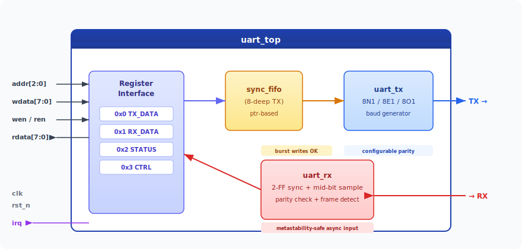
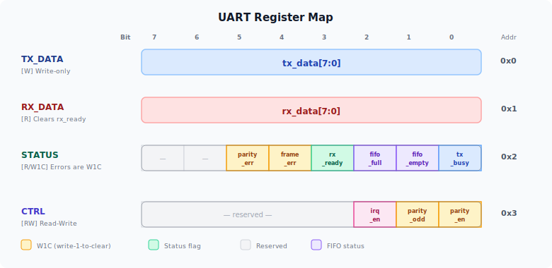
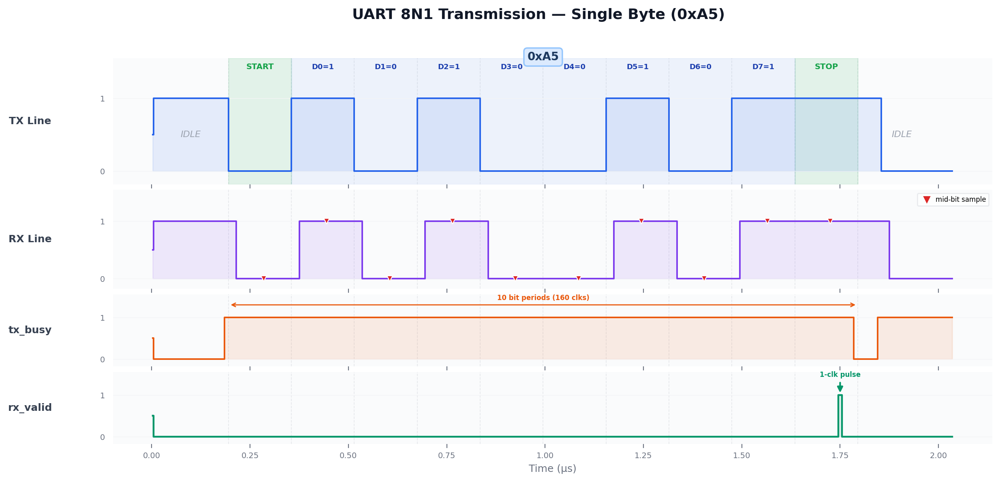
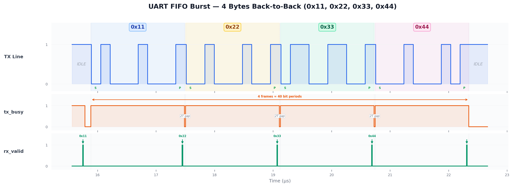
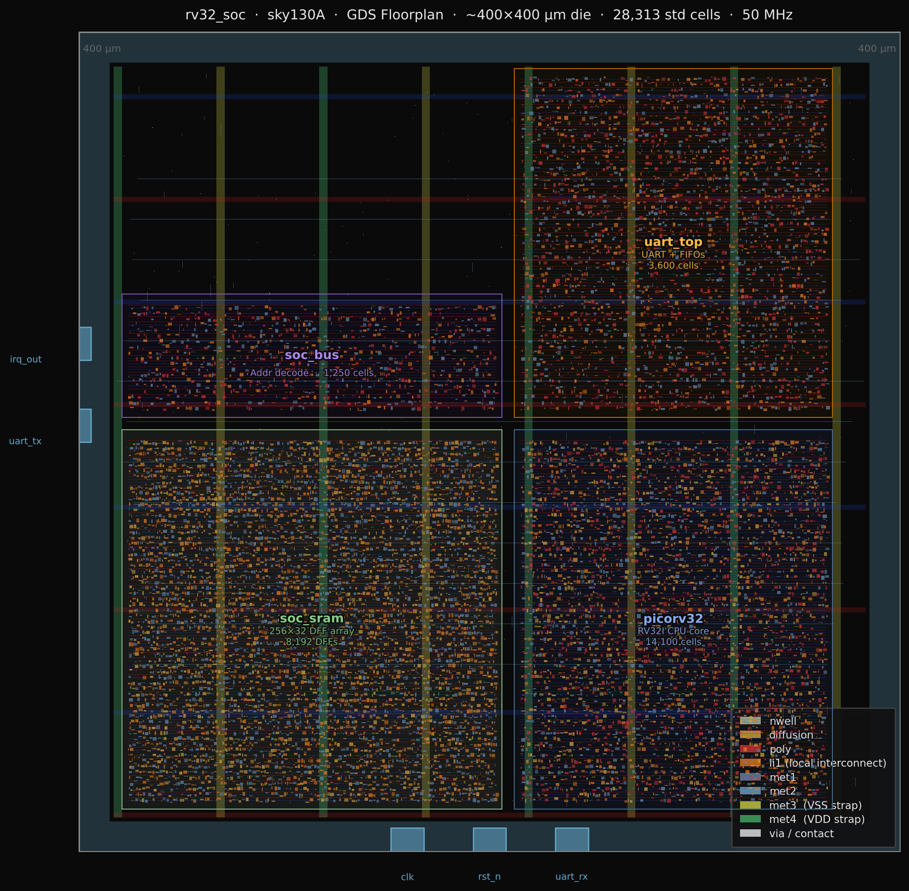

# UART Controller IP — RTL to GDSII (Sky130)

## What is UART?

**UART** (Universal Asynchronous Receiver-Transmitter) is one of the simplest and most widely used hardware communication protocols. It allows two devices to send data to each other over just two wires — one for sending (TX) and one for receiving (RX) — without needing a shared clock signal.

**How it works:** When a device wants to send a byte (8 bits of data), it doesn't just dump all 8 bits at once. Instead, it sends them one bit at a time over a single wire, like spelling out a word letter-by-letter. Each transmission follows a strict format called a **frame**:

1. **Start bit** — The line is normally held HIGH (idle). To begin, the sender pulls it LOW for one bit period. This tells the receiver: "a byte is coming."
2. **Data bits** — The 8 bits of data are sent one at a time, least-significant bit first.
3. **Stop bit** — The line goes back HIGH for one bit period, marking the end of the frame.

Both devices must agree on the **baud rate** — the speed of transmission (how long each bit lasts). A common rate is 115,200 bits per second. Because there's no shared clock wire, the receiver uses the start bit's falling edge to synchronize and then samples each data bit at the midpoint of its expected time window.

UART is everywhere: microcontrollers, GPS modules, Bluetooth chips, serial terminals, embedded systems, and debug interfaces all use it.

## What We Built

This project implements a **complete UART controller as a silicon-ready chip design**, taken from concept all the way to a physical layout that could be fabricated on a real chip. Specifically:

- **A transmitter** that takes bytes from software and serializes them into the UART frame format described above.
- **A receiver** that listens on the RX wire, detects start bits, samples data at the centre of each bit, reassembles bytes, and flags errors (bad stop bit, parity mismatch).
- **A FIFO buffer** (First In, First Out — a small queue) that stores up to 8 bytes waiting to be transmitted, so software can write data in bursts without waiting for each byte to finish sending.
- **A register interface** that lets software control the whole peripheral by reading and writing to 4 simple addresses — just like how a driver talks to any hardware device in a real chip.

The design is written in **Verilog** (the standard language for describing digital hardware), fully verified with automated tests, and then taken through an industry-standard **ASIC flow** (using OpenLane + SkyWater 130 nm process) to produce an actual chip layout — complete with timing analysis, power estimates, and design-rule checks that confirm it could be manufactured.

---

## Architecture

The top-level `uart_top` module integrates a transmitter, receiver, 8-deep TX FIFO, and a 4-register control interface. The bus-agnostic `addr/wdata/rdata` protocol maps trivially onto APB, Wishbone, or any SoC fabric.

<p align="center">
  
</p>

| Module | Description |
|--------|-------------|
| **uart_top** | Register-mapped wrapper — FIFO, status/ctrl registers, interrupt |
| **uart_tx** | Transmitter with configurable parity (8N1 / 8E1 / 8O1) |
| **uart_rx** | Receiver with 2-FF metastability synchronizer, mid-bit sampling, parity check |
| **sync_fifo** | Parameterised synchronous FIFO — pointer-based, fall-through read |

---

## Register Map

Four registers control the peripheral. Error flags use the industry-standard **W1C** (write-1-to-clear) pattern — write a `1` to acknowledge and clear.

<p align="center">
  
</p>

| Addr | Name | Access | Bits |
|------|------|--------|------|
| 0x0 | **TX_DATA** | W | `tx_data[7:0]` — write a byte into the TX FIFO |
| 0x1 | **RX_DATA** | R | `rx_data[7:0]` — read last received byte (clears `rx_ready`) |
| 0x2 | **STATUS** | R/W1C | `{—, —, parity_err, frame_err, rx_ready, fifo_full, fifo_empty, tx_busy}` |
| 0x3 | **CTRL** | RW | `{—, —, —, —, —, irq_en, parity_odd, parity_en}` |

---

## Simulation Waveforms

### Single Byte Transfer (8N1 — 0xA5)

The TX line drops LOW for the start bit, then transmits 8 data bits LSB-first, followed by a HIGH stop bit. The `rx_valid` pulse confirms successful reception through the 2-FF synchronizer.

<p align="center">
  
</p>

### FIFO Burst — 4 Bytes Back-to-Back

Four bytes are written to the TX FIFO in rapid succession. The serialiser drains them one at a time with no idle gaps between frames — demonstrating that the FIFO decouples the bus write rate from the serial line speed.

<p align="center">
  
</p>

---

## Verification

Self-checking testbench with **6 test groups** — all passing:

| # | Test | What it verifies |
|---|------|------------------|
| 1 | 8N1 loopback | TX→RX with 5 patterns: `0xA5, 0x00, 0xFF, 0x55, 0xAA` |
| 2 | Even parity (8E1) | Parity generation and checking — even mode |
| 3 | Odd parity (8O1) | Parity generation and checking — odd mode |
| 4 | FIFO burst | 4 bytes back-to-back, verify in-order delivery |
| 5 | Framing error | Injected bad stop bit → `frame_err` sticky flag set |
| 6 | Status flags | Idle state: `fifo_empty=1, tx_busy=0` |

```
ALL TESTS PASSED (6 tests)
```

---

## Physical Design (GDSII)

Layout generated by OpenLane targeting Sky130 HD standard cells. The design passes all signoff checks: DRC clean, LVS clean, no antenna violations.

<p align="center">
  
</p>

<sub>KLayout view of the <code>uart_tx</code> GDSII. The full <code>uart_top</code> (with FIFO + RX) produces a proportionally larger layout when re-synthesised.</sub>

### Signoff Results

| Metric | Value |
|--------|-------|
| Technology | SkyWater 130 nm (`sky130_fd_sc_hd`) |
| Clock period | 10 ns (100 MHz target) |
| Worst setup slack | **+78.59 ns** |
| Worst hold slack | **+0.34 ns** |
| Total power (typical) | **61.2 uW** |
| Cell count | 145 |
| Cell area | 1 565 um^2 |
| Die | 60 x 71 um |
| DRC violations | **0** |
| LVS errors | **0** |
| Antenna violations | **0** |

---

## Key Design Decisions

| Decision | Alternative considered | Rationale |
|----------|----------------------|-----------|
| **2-FF synchronizer** on RX | No synchronizer | RX is async to `clk` — mandatory for real silicon |
| **Mid-bit sampling** | Triple-sample majority vote | Adequate noise immunity; majority vote adds ~20% logic |
| **W1C error flags** | Clear-on-read | Industry standard (ARM AMBA, RISC-V PLIC); avoids simulation race conditions |
| **TX FIFO (8-deep)** | No FIFO | Enables burst writes; decouples bus from serial line |
| **Synchronous active-low reset** | Async reset | Cleaner timing closure — `rst_n` meets setup/hold like any input |
| **Fixed baud divider (parameter)** | Runtime register | Minimises counter width; easy to extend with a divisor register |
| **Fall-through FIFO** | Registered read | Saves 1 cycle latency; requires a data latch (`tx_data_reg`) at the consumer |

---

## Repository Structure

```
rtl/
  uart_top.v           Top-level register-mapped controller
  uart_tx.v            UART transmitter
  uart_rx.v            UART receiver (2-FF sync, parity)
  sync_fifo.v          Parameterised synchronous FIFO
tb/
  uart_top_tb.v        Self-checking testbench (6 tests)
  Makefile             Simulation build / run
  simulation_results.txt
openlane/
  config.json          OpenLane design configuration
  pin_order.cfg        Pin placement constraints
docs/
  images/              Architecture, register map, waveforms, layout
  gen_waveforms.py     Script to regenerate waveform PNGs from VCD
  gen_diagrams.py      Script to regenerate SVG diagrams
```

## How to Run

### Simulation

```bash
cd tb
make sim          # compile + run all 6 tests
make wave         # open VCD in GTKWave
```

### Regenerate Diagrams

```bash
cd tb && make sim           # produces uart_top_tb.vcd
python3 docs/gen_waveforms.py
python3 docs/gen_diagrams.py
```

### OpenLane ASIC Flow

```bash
# Inside the OpenLane Docker container:
# Copy openlane/ → designs/uart_top/  and  rtl/ → designs/uart_top/src/
./flow.tcl -design uart_top
```

## Tools

| Tool | Purpose |
|------|---------|
| Icarus Verilog | RTL simulation |
| OpenLane v1.0.2 | Full ASIC flow (synthesis → signoff) |
| SkyWater sky130A PDK | 130 nm standard cell library |
| KLayout | GDS layout viewer |
| Python + matplotlib | Waveform / diagram generation |

## License

UART IP source code is original work. OpenLane flow infrastructure is [Apache 2.0](https://www.apache.org/licenses/LICENSE-2.0) (Efabless Corporation).
