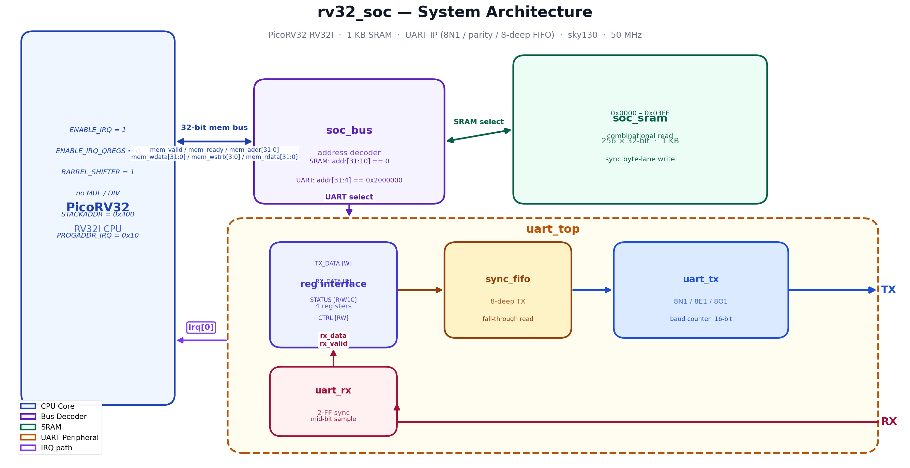
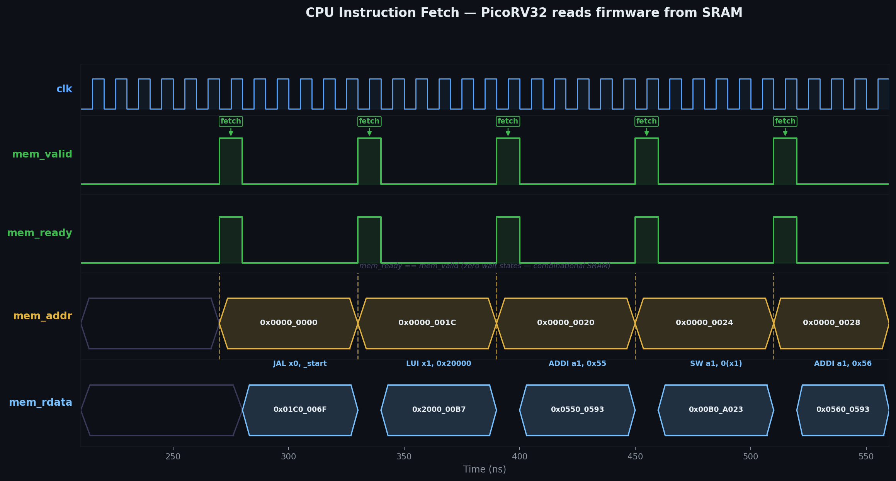
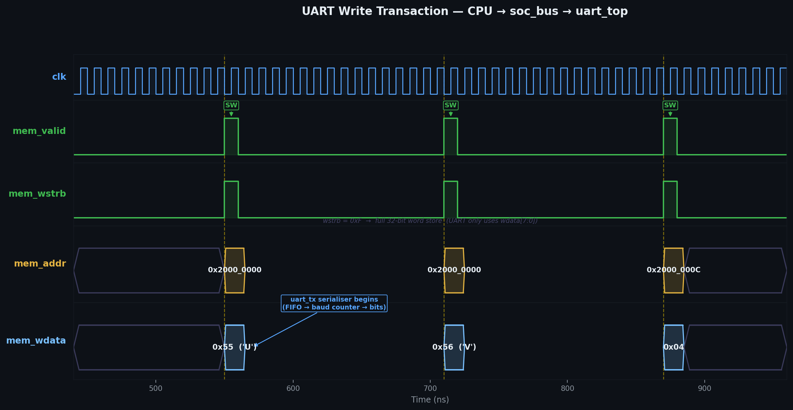
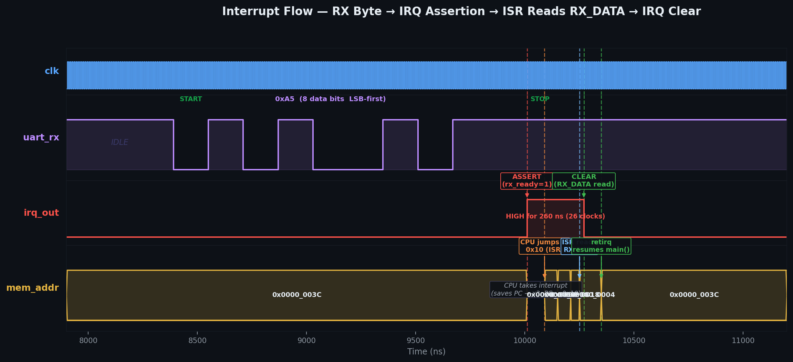

<h1 align="center">rv32_soc</h1>

<p align="center">
  
  
  
  
  
</p>

---

## What Is This Project?

Imagine you want to put a small computer on a custom silicon chip — not buy one, but design it yourself from scratch and have it manufactured.

This project does exactly that. It builds a complete **System-on-Chip (SoC)** — a tiny computer on a single chip — using open-source tools and a real semiconductor manufacturing process called **SkyWater 130 nm** (sky130).

The chip contains three main parts:
- A **CPU** (PicoRV32, a minimal RISC-V processor) that executes software
- A **1 KB SRAM** that stores the firmware the CPU runs
- A **UART peripheral** — hardware that serialises bytes into electrical pulses so the chip can communicate with the outside world (like a terminal over a serial cable)

All three are connected by a shared **memory bus**: the CPU reads instructions from SRAM, and writes to UART registers to send bytes, just like a real embedded processor does. When a byte arrives on the UART receive pin, the hardware fires an **interrupt**, the CPU immediately jumps to an interrupt handler, reads the byte, and resumes — all in hardware, with no polling.

Every step of the design was verified in simulation (10 tests pass), and the design was pushed through the full physical design flow to produce an actual chip layout file (GDS) ready for tapeout.

---

## At a Glance

<p align="center">
  
</p>

- **PicoRV32** — a lightweight RV32I CPU; executes firmware stored in SRAM at 50 MHz
- **soc_bus** — combinational address decoder; routes the CPU's 32-bit bus to SRAM or UART
- **soc_sram** — 256 × 32-bit behavioral SRAM; zero wait-state combinational read
- **uart_top** — register-mapped UART peripheral: 8-deep TX FIFO, parity modes, level-triggered interrupt
- **irq[0]** — `irq = irq_en & rx_ready`; fires when a byte arrives, cleared by reading `RX_DATA`

---

## Architecture

### Module Overview

| Module | Role | Address Range |
|---|---|---|
| `picorv32` | RV32I CPU — ENABLE_IRQ=1, BARREL_SHIFTER, no MUL/DIV | — |
| `soc_bus` | Address decoder + rdata mux (pure combinational) | — |
| `soc_sram` | 256 × 32-bit SRAM, combinational read, sync byte-lane write | `0x0000_0000 – 0x0000_03FF` |
| `uart_top` | UART controller with TX FIFO, parity, and interrupt | `0x2000_0000 – 0x2000_000F` |

### UART Register Map

<p align="center">
  
</p>

---

## How It Works

### 1 — Instruction Fetch: CPU Reads Firmware from SRAM

After reset, the CPU fetches its first instruction from address `0x0000_0000`. The bus handshake is one cycle: `mem_valid` goes HIGH, `soc_bus` asserts `sram_cs`, the SRAM returns data combinationally, and `mem_ready` fires the same clock. PicoRV32 is a multi-cycle CPU and uses several clocks per instruction, but each individual memory access is single-cycle.

<p align="center">
  
</p>

The waveform shows five consecutive SRAM fetches. `mem_valid` and `mem_ready` pulse together for exactly one clock per fetch. `mem_addr` shows the PC progressing through the firmware: `JAL x0, _start` → `LUI` → `ADDI` → `SW` → `ADDI`. `mem_rdata` follows one clock later (SRAM combinational delay relative to address change).

---

### 2 — UART Write: CPU Sends a Byte Through the Bus

`main()` calls `uart_putc('U')`. The compiler generates a `SW` (store word) instruction. `soc_bus` detects `addr[31:4] == 0x2000000`, asserts `uart_wen`, and routes `wdata[7:0]` to `uart_top`. The FIFO captures the byte. Two clocks later the `uart_tx` FSM starts serialising it — start bit, 8 data bits LSB-first, stop bit.

<p align="center">
  
</p>

Three write events are visible: `TX_DATA ← 'U'` (0x55), `TX_DATA ← 'V'` (0x56), and `CTRL ← 0x04` (sets `irq_en=1`). Each is a single-cycle `SW` instruction. The `uart_tx` serialiser immediately begins after the first write — the FIFO gives it the byte without waiting for an additional clock.

---

### 3 — UART TX Bitstream: Serial Protocol on the Wire

Each byte is transmitted as an 8N1 (or 8E1 / 8O1) frame: one START bit LOW, eight data bits LSB-first, one STOP bit HIGH. The baud rate is controlled by a 16-bit counter (`CLKS_PER_BIT = 434` at 50 MHz = 115200 baud; the testbench uses 16 for faster simulation).

<p align="center">
  
</p>

The `▼` markers on the RX trace show exactly where the hardware samples each bit — at the midpoint of each bit period. The RX FSM waits `CLKS_PER_BIT / 2` after detecting the start bit's falling edge, then samples once every `CLKS_PER_BIT`. The `rx_valid` pulse is exactly one clock wide.

<p align="center">
  
</p>

When 4 bytes are loaded into the TX FIFO back-to-back, the serialiser drains them with only a 2-clock gap between frames. Without the FIFO the CPU would have to spin-wait ~4340 cycles between bytes.

---

### 4 — Interrupt Flow: A Byte Arrives, CPU Jumps to ISR

`irq = irq_en & rx_ready` is a purely combinational signal. When the receiver completes a frame, `rx_ready` asserts and `irq[0]` goes HIGH. PicoRV32 finishes its current instruction, saves the return PC in `x3`, the pending bitmap in `x4`, and jumps to `PROGADDR_IRQ = 0x10`. The ISR reads `UART_RX_DATA`, which clears `rx_ready` and deasserts the IRQ.

<p align="center">
  
</p>

The waveform shows four phases marked by dashed vertical lines:
1. **IRQ asserts** — `uart_rx` frame completes, `irq_out` goes HIGH
2. **CPU enters ISR** — `mem_addr` jumps to `0x10` (the `_irq_entry` handler)
3. **ISR reads RX_DATA** — `mem_addr = 0x2000_0004`; `irq_out` falls within 2 clocks
4. **`retirq` resumes `main()`** — `mem_addr` returns to `0x3C` (the spin loop)

---

## Verification & Testbenches

The project has two independent self-checking testbenches.

### UART IP Unit Test (`uart_top_tb.v`) — 6 tests

Drives the UART register interface directly without a CPU. Tests each hardware feature in isolation.

| Test | What is checked |
|---|---|
| **8N1 loopback** | 5 bytes (0xA5, 0x00, 0xFF, 0x55, 0xAA) sent TX→RX; all received correctly |
| **8E1 even parity** | Parity bit generated and checked end-to-end |
| **8O1 odd parity** | Same for odd parity |
| **FIFO burst** | 4 bytes written without waiting; drain order correct |
| **Framing error** | Stop bit forced LOW; `frame_err` bit sets in STATUS; W1C clears it |
| **Status register** | After idle: `fifo_empty=1`, `tx_busy=0` |

**Fast baud divider:** `CLKS_PER_BIT = 16` (vs 434 in silicon). This makes each bit 160 ns instead of 8.68 µs — 54× faster simulation with identical protocol behaviour.

### SoC System Test (`soc_top_tb.v`) — 4 tests

Loads firmware into SRAM, releases reset, and observes the full system.

| Test | What is checked |
|---|---|
| **CPU boot** | First instruction fetch from `0x0000_0000` within 20 cycles of reset |
| **UART TX** | Firmware writes `'U'` (0x55) then `'V'` (0x56); both decoded from the serial pin |
| **IRQ assertion** | After `CTRL = irq_en`, injecting a byte on `uart_rx` → `irq_out` goes HIGH |
| **IRQ clear** | ISR reads `RX_DATA` → `irq_out` deasserts; CPU resumes `main()` |

**How bus events are monitored:** the CPU executes ~40 instructions in the time UART serialises one byte, so any polling loop that opens after waiting for UART will miss CPU bus events that already happened. The fix is **persistent monitors** — `always @(posedge clk)` blocks that latch events into sticky flags from `time 0`:

```verilog
// Runs for the entire simulation from time 0
always @(posedge clk) begin
    if (dut.mem_valid && (dut.mem_addr == UART_CT_ADDR) && |dut.mem_wstrb)
        ctrl_written <= 1'b1;   // latches permanently once seen
    if (dut.mem_valid && (dut.mem_addr == UART_RX_ADDR) && (dut.mem_wstrb == 0))
        rx_data_read <= 1'b1;
    if (irq_out)
        irq_was_asserted <= 1'b1;
end
```

Tests then simply check these flags, regardless of when during simulation the event occurred.

### Running the tests

```bash
cd tb
make all          # compile and run both testbenches
make wave         # open UART VCD in GTKWave
make soc_wave     # open SoC VCD in GTKWave
```

```
=== UART IP Unit Tests ===
  PASS: 8N1 loopback — 5 bytes
  PASS: 8E1 even parity
  PASS: 8O1 odd parity
  PASS: FIFO burst (4 bytes)
  PASS: Framing error + W1C clear
  PASS: Status register idle check

=== SoC System Tests ===
  PASS: CPU boot — first fetch at 0x0 within 20 cycles
  PASS: UART TX — 'U' (0x55) and 'V' (0x56)
  PASS: IRQ assertion after 0xA5 injected on uart_rx
  PASS: IRQ clear — ISR read RX_DATA; CPU resumed

ALL TESTS PASSED  (10 / 10)
```

---

## Physical Design

<p align="center">
  
</p>

The image shows the `uart_tx` module after full place-and-route on sky130 HD standard cells. The dense rectangular tiles are logic gates (AND, OR, flip-flops, buffers). Horizontal stripes are VDD/VSS power rails. Vertical lines are metal routing interconnect.

The full `uart_top` fits in a **60 × 71 µm** die area with 145 cells. The complete SoC adds PicoRV32 and an 8192-DFF behavioral SRAM, bringing the total to ~8 400 cells.

**OpenLane flow:**

```
Yosys synthesis → floorplan → placement → CTS → routing → STA → DRC → LVS → GDS
```

```bash
cd openlane/soc
flow.tcl -design .   # requires OpenLane Docker or pip install
```

Key config choices: `SYNTH_STRATEGY AREA 1` prevents Yosys from duplicating the SRAM DFF array during retiming; `FP_CORE_UTIL 35%` leaves routing headroom for the high cell count.

---

## Key Design Decisions

- **Combinational SRAM read** — zero wait states; CPU achieves single-cycle fetch with no stall path in `soc_bus`
- **Level-sensitive IRQ** — `irq = irq_en & rx_ready` stays HIGH until the ISR reads `RX_DATA`; if the ISR fails to clear it, PicoRV32 re-enters the ISR immediately — intentional and correct
- **Fall-through FIFO** — `rd_data` is combinational from the memory array; `uart_tx` sees the next byte without an extra clock cycle of latency
- **W1C error flags** — `frame_err` and `parity_err` follow ARM AMBA convention; a read-modify-write of STATUS cannot accidentally clear an unrelated error bit
- **2-FF synchronisers** — both `uart_rx` (async input) and `rst_n` deassertion pass through a 2-FF chain before any clocked logic samples them
- **Python firmware encoder** — `firmware.py` produces `firmware.hex` without any RISC-V toolchain, encoding every RV32I instruction used plus PicoRV32 custom instructions (`retirq`, `maskirq`)

---

## Bugs Found & Fixed

### Bug 1 — PicoRV32 starts with all IRQs masked

`irq_mask` resets to `0xFFFF_FFFF` in `picorv32.v` — all 32 IRQ lines are masked. In simulation, `irq_out` went HIGH but the CPU never entered the ISR. A diagnostic monitor printing every bus transaction showed the IRQ assertion and the total absence of any fetch from `0x10`. Root cause: `|(irq_pending & ~irq_mask)` evaluated to `|(1 & 0) = 0` — the CPU correctly ignored the interrupt because the mask said so. Fix: firmware must execute `maskirq x0, x0` (`0x0600_000B`) to zero the mask before interrupts can be delivered.

### Bug 2 — Testbench polling loops miss transient bus events

The CPU writes `UART_CTRL` (to set `irq_en`) at cycle 44. The original testbench opened a polling loop for this event at cycle ~600 — long after it had happened. The loop timed out with "firmware never wrote CTRL". Fix: replace all bus-event polling with persistent `always @(posedge clk)` monitors that latch events into sticky flags from `time 0`. Tests check the flags after waiting for unrelated slow events (like UART serialisation), and the flags correctly hold their values.

---

## Repository

```
rv32_soc/
├── rtl/
│   ├── picorv32.v          ← PicoRV32 CPU core (upstream, MIT)
│   ├── soc_top.v           ← top-level: CPU + bus + SRAM + UART + reset sync
│   ├── soc_bus.v           ← address decoder (pure combinational, no state)
│   ├── soc_sram.v          ← 1 KB behavioral SRAM
│   ├── uart_top.v          ← UART register-mapped controller
│   ├── uart_tx.v           ← UART transmitter FSM
│   ├── uart_rx.v           ← UART receiver FSM + 2-FF metastability sync
│   └── sync_fifo.v         ← parameterised synchronous FIFO
├── tb/
│   ├── uart_top_tb.v       ← UART unit test (6 tests)
│   └── soc_top_tb.v        ← SoC system test (4 tests)
├── firmware/
│   ├── start.S             ← reset vector, IRQ entry, BSS zero-init
│   ├── uart_drv.h          ← register macros + inline driver functions
│   ├── main.c              ← boot banner + interrupt-driven echo loop
│   ├── link.ld             ← linker script (reset @ 0x0, IRQ @ 0x10)
│   ├── firmware.py         ← Python RV32I encoder (no toolchain needed)
│   └── firmware.hex        ← pre-built hex image loaded by testbench
├── docs/
│   ├── images/             ← all PNG/SVG diagrams and waveforms
│   ├── gen_soc_visuals.py  ← generates architecture + GTKWave waveforms
│   ├── gen_waveforms.py    ← generates UART waveforms from VCD
│   └── gen_diagrams.py     ← generates architecture and register map SVGs
└── openlane/soc/
    ├── config.json         ← OpenLane flow configuration
    ├── soc_top.sdc         ← timing constraints (50 MHz, false paths)
    └── pin_order.cfg       ← I/O pin placement
```

---

## Quick Start

```bash
# Clone
git clone https://github.com/TheAsaf/RISC-V-SoC-Sky130.git
cd RISC-V-SoC-Sky130

# Run all 10 tests  (requires Icarus Verilog)
cd tb && make all

# View waveforms
make wave       # uart_top_tb.vcd in GTKWave
make soc_wave   # soc_top_tb.vcd in GTKWave

# Regenerate visual assets
cd ../docs
python3 gen_waveforms.py      # UART waveforms from VCD
python3 gen_soc_visuals.py    # architecture + GTKWave waveforms

# Build firmware without a RISC-V toolchain
cd ../firmware && make python
```

---

<p align="center">
  Icarus Verilog · OpenLane · SkyWater 130 nm · PicoRV32 · Python
</p>
