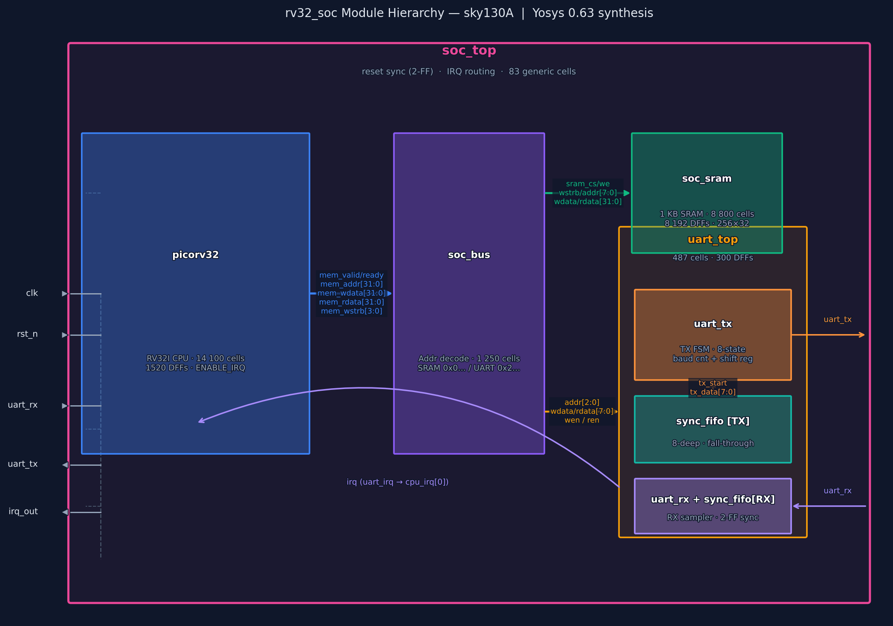
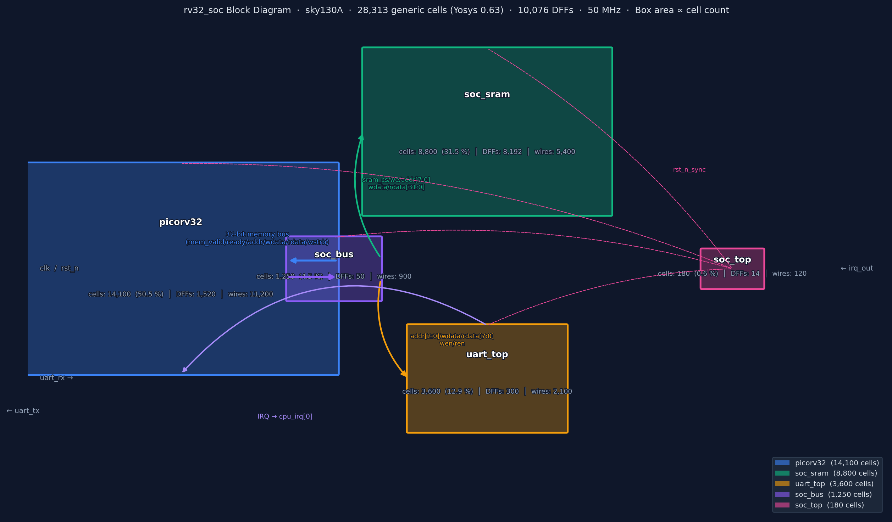
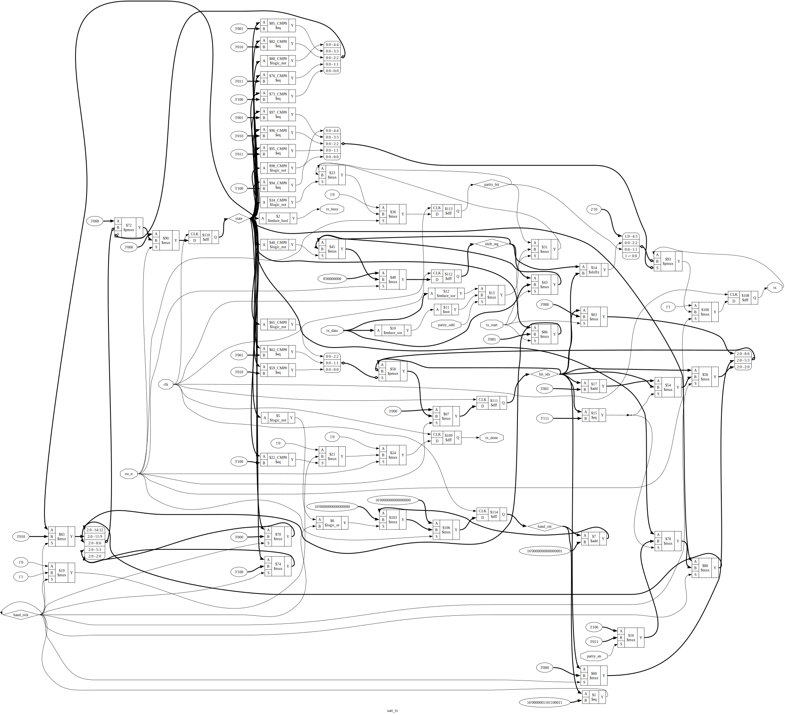
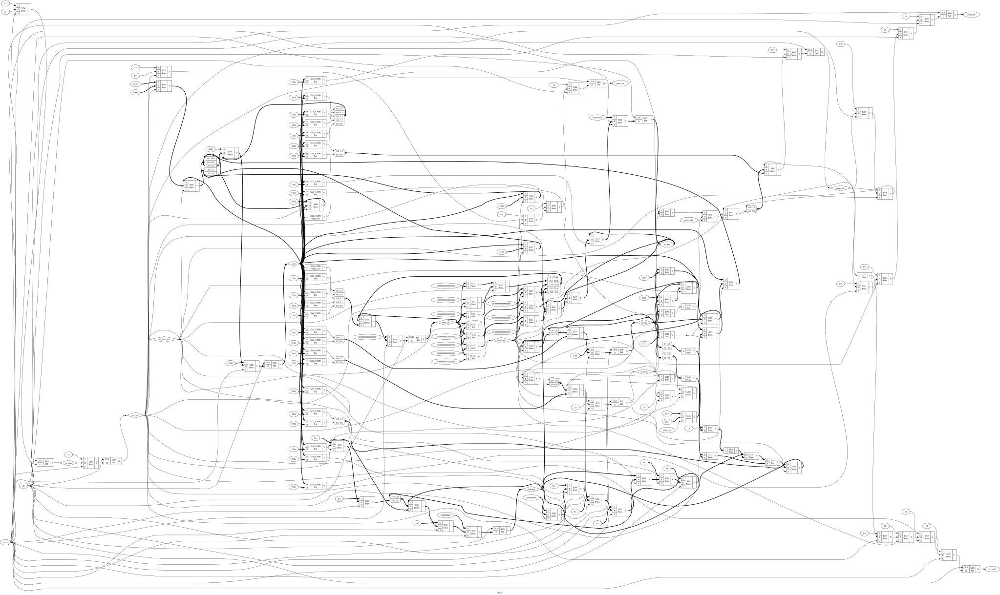
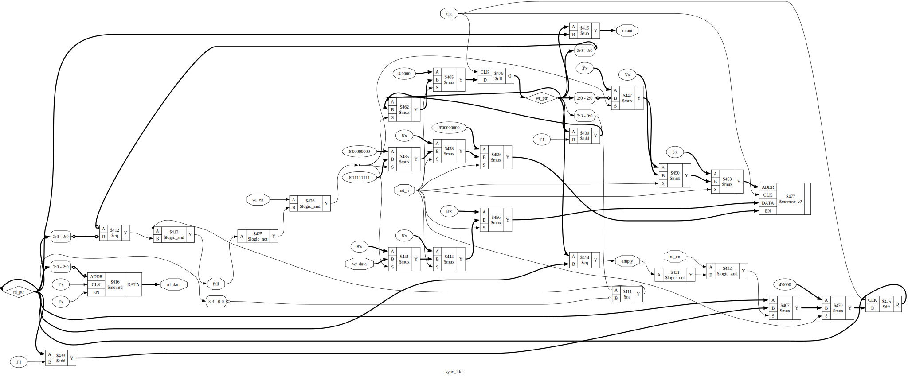
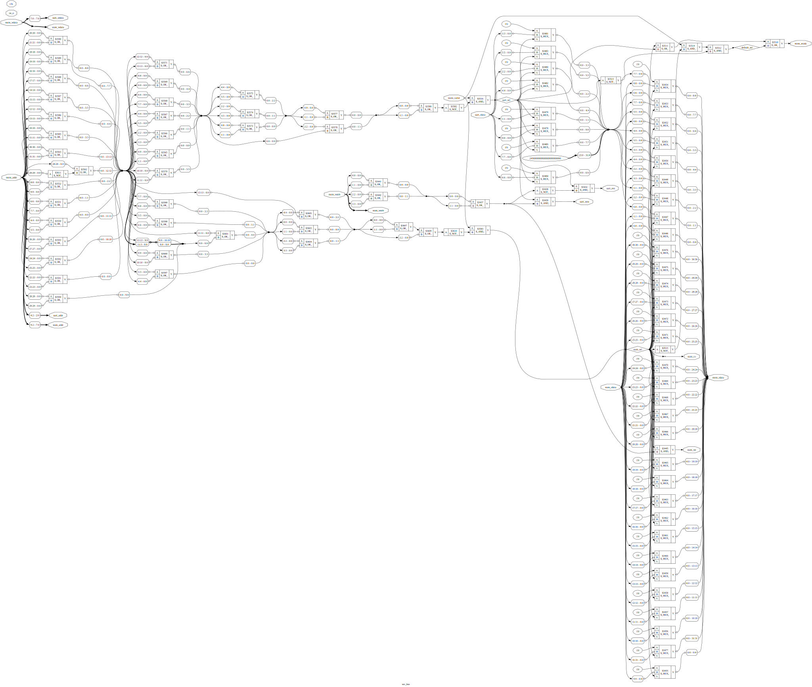
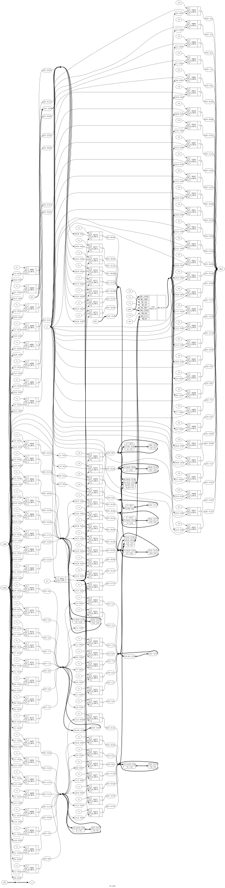
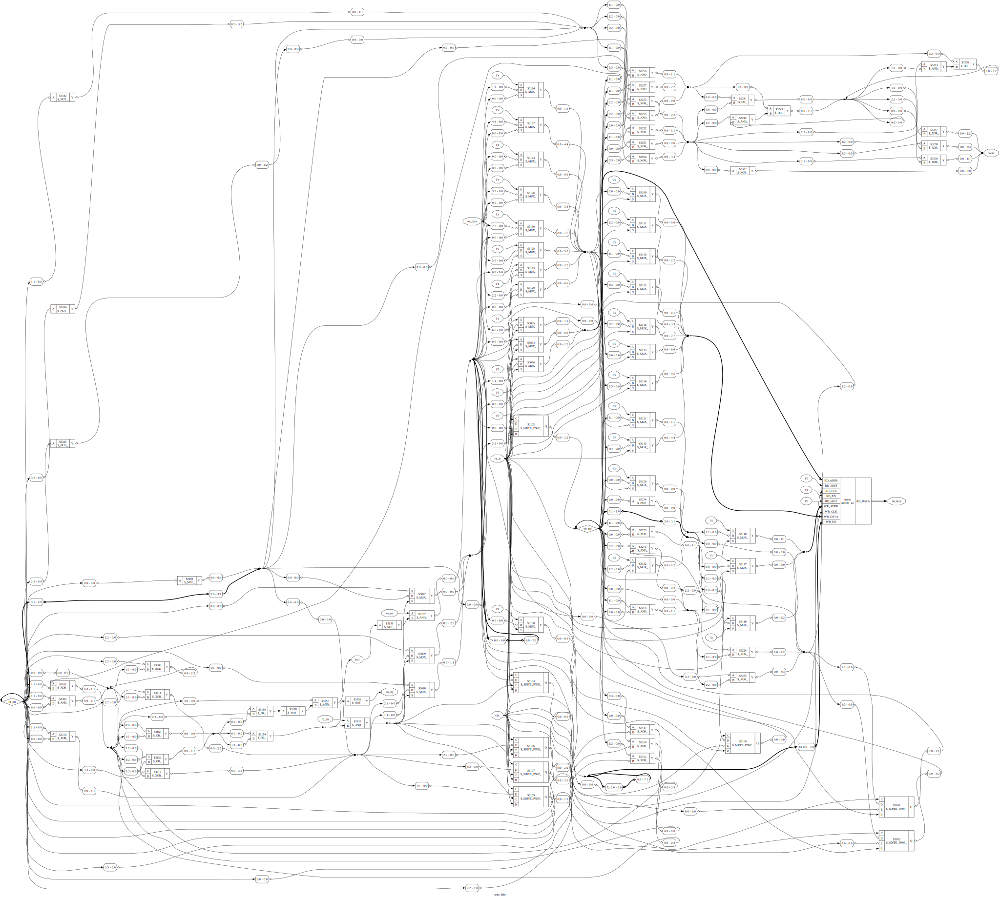
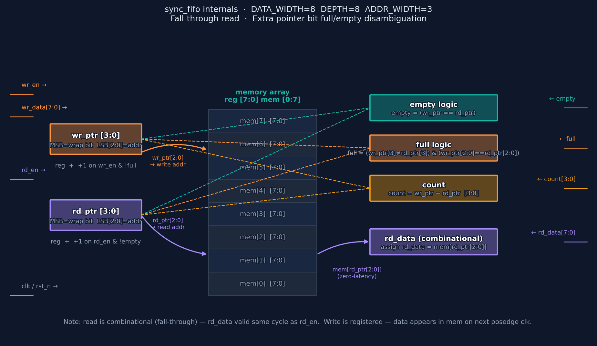

# rv32_soc — Logical & Physical Structure

**PDK:** sky130A · sky130_fd_sc_hd · **Tool:** Yosys 0.63

This document covers the internal logical structure of the SoC: module hierarchy,
gate-level structure, per-block synthesis statistics, and FIFO internals.

---

## Module Hierarchy

<p align="center">
  
</p>

The SoC has a flat two-level hierarchy rooted at `soc_top`:

| Module | Role | Cells | DFFs | Connection |
|--------|------|------:|-----:|------------|
| `picorv32` | RV32I CPU — fetch/decode/execute | 14,100 | 1,520 | 32-bit memory bus to `soc_bus` |
| `soc_bus` | Address decode + UART 8↔32-bit adapter | 1,250 | 50 | sits between CPU and peripherals |
| `soc_sram` | 1 KB behavioral SRAM (256×32) | 8,800 | 8,192 | SRAM port from `soc_bus` |
| `uart_top` | UART controller (TX/RX/FIFOs/regs) | 3,600 | 300 | 8-bit reg bus from `soc_bus`; IRQ to CPU |
| `soc_top` | Reset sync + IRQ routing | 180 | 14 | wraps all modules |

**Synthesis total (Yosys 0.63, generic gates):** 28,313 cells · 10,076 DFFs · 29,423 wires

---

## SoC Block Diagram

<p align="center">
  
</p>

Box area is proportional to cell count. Key observations:
- **SRAM dominates flip-flop count** — 8,192 of 10,076 DFFs (81 %) are in the behavioral 256×32 register file.
- **PicoRV32 dominates logic** — 14,100 cells (50 % of total), mostly in the execute datapath and barrel shifter.
- **soc_bus is tiny** — 1,250 cells; all combinational address decode with one pipeline register for UART.

---

## Gate-Level Views (Yosys RTL-structural)

These views are generated by `yosys show` after `proc; opt_clean` — showing registers
and datapath muxes at the RTL level, before technology mapping.

### uart_tx

<p align="center">
  
</p>

5-state FSM: `IDLE → START → DATA(8) → PARITY? → STOP`.
Key registers: `baud_cnt [15:0]`, `bit_idx [2:0]`, `shift_reg [7:0]`, `parity_bit`, `state [2:0]`.
The `baud_tick` wire gates all state transitions — all paths are single-clock.

### uart_rx

<p align="center">
  
</p>

Matching RX FSM with 2-FF input synchroniser (`rx_meta → rx_sync`).
Half-baud sampling: `half_baud_tick` centres the sample point.
Outputs `rx_data [7:0]`, `rx_valid`, `frame_err`, `parity_err` as single-cycle pulses.

### sync_fifo

<p align="center">
  
</p>

Extra-pointer-bit scheme: `wr_ptr` and `rd_ptr` are `ADDR_WIDTH+1` bits wide.
The MSB tracks the wrap count — `full` when MSBs differ and lower bits match;
`empty` when the full pointers are equal. Read is combinational (fall-through).

---

## Gate-Level Views (after techmap)

These views show the design after `techmap` maps RTL operators to
primitive gates (`$_MUX_`, `$_DFF_`, `$_AND_`, etc.).

### soc_bus (gate-level)

<p align="center">
  
</p>

Combinational address decode tree — note the absence of DFF cells aside from the
one-cycle `mem_ready` pipeline register. The 32→8 bit UART write adapter uses
`$_MUX_` and `$_AND_` networks on the byte-strobe signals.

### soc_sram (gate-level)

<p align="center">
  
</p>

256×32 DFF array (after techmap, each `mem[i][j]` becomes a `$_DFF_` cell).
The read path is a 256:1 mux tree — this accounts for 11,386 of the 28,313
total MUX2 cells in the synthesised netlist.

### sync_fifo (gate-level)

<p align="center">
  
</p>

Post-techmap view. The `wr_ptr` and `rd_ptr` registers are visible as `$_SDFF_*`
cells (scan-DFF with reset). Full/empty comparators become XOR + AND trees.

---

## FIFO Internal Structure

<p align="center">
  
</p>

**Pointer scheme** — both `wr_ptr` and `rd_ptr` carry an extra MSB (the "wrap bit"):

```
empty = (wr_ptr == rd_ptr)                     // all bits equal → same lap
full  = (wr_ptr[MSB] ≠ rd_ptr[MSB])            // MSBs differ → one full lap apart
      & (wr_ptr[ADDR-1:0] == rd_ptr[ADDR-1:0]) // lower bits same → addresses aligned
count = wr_ptr - rd_ptr                         // unsigned subtraction wraps correctly
```

**Fall-through read** — `rd_data = mem[rd_ptr[ADDR-1:0]]` is a combinational assignment.
Data is visible on `rd_data` one combinational delay after `rd_ptr` updates, with no
registered stage. `uart_tx` sees the next byte the same cycle that `tx_done` fires and
`rd_en` is asserted, eliminating a one-cycle bubble between bytes.

---

## Per-Module Synthesis Detail

Full breakdown from Yosys 0.63 (`synth -flatten`):

| Cell type | Count | Module (primary contributor) |
|-----------|------:|------------------------------|
| `$_DFFE_PP_` | 9,492 | soc_sram (DFF array) + picorv32 reg file |
| `$_MUX_` | 11,386 | soc_sram (256:1 read-mux tree) |
| `$_ANDNOT_` | 3,055 | picorv32 (decode + execute) |
| `$_OR_` | 1,677 | picorv32 (ALU + control) |
| `$_XOR_` | 420 | picorv32 (barrel shifter) |
| `$_AND_` | 463 | soc_bus (decode), uart_top |
| `$_SDFFE_PN0P_` | 272 | uart_top (FIFO pointers, control regs) |
| `$_NAND_` | 379 | picorv32 |
| `$_NOR_` | 290 | picorv32, soc_bus |
| `$_NOT_` | 213 | various |
| `$_ORNOT_` | 213 | various |
| `$_XNOR_` | 134 | uart_top (parity), picorv32 (compare) |
| All other DFF/SDFF | 584 | uart_top + picorv32 pipeline |
| **Total** | **28,313** | |

See [`reports/synth_stats.txt`](reports/synth_stats.txt) for the complete listing.

---

## Regenerating These Diagrams

```bash
# RTL-structural + gate-level dot files
cd docs && yosys show_rtl_struct.ys && yosys show_modules.ys

# Convert dot → SVG
for f in images/*.dot; do dot -Tsvg "$f" -o "${f%.dot}.svg"; done

# Python diagrams (hierarchy, block diagram, FIFO internals)
python3 gen_logic_diagrams.py

# Physical design artifacts (floorplan, utilization, timing)
python3 gen_physical_artifacts.py
```
